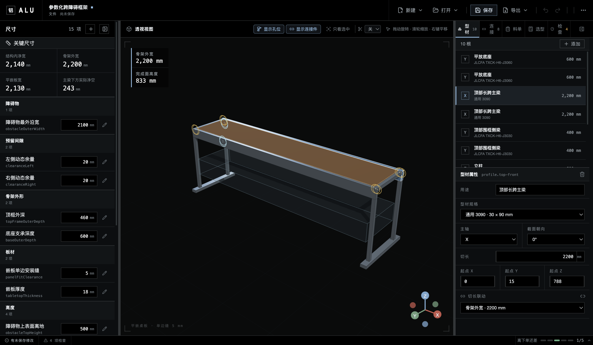
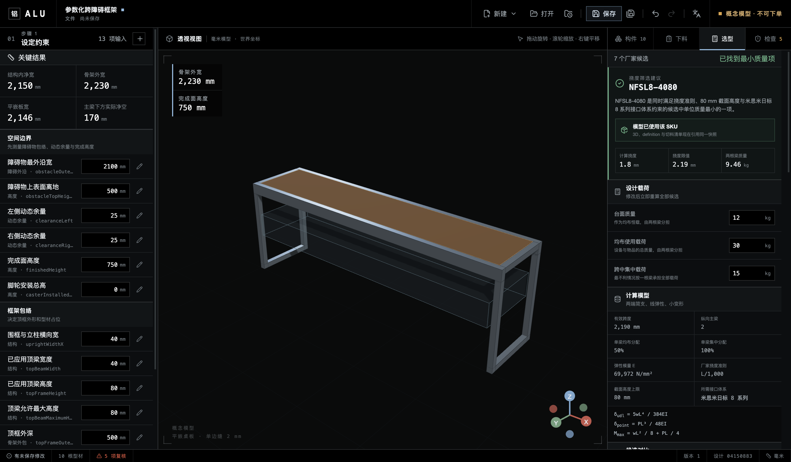

<h1 align="center">
   ALU
</h1>

<p align="center">
  <a href="https://github.com/OWRIG/alu"></a>
  <a href="https://github.com/OWRIG/alu/releases"></a>
  
  
</p>

<p align="center">
  <sub><a href="README.md">简体中文</a> · <strong>English</strong></sub>
</p>

<p align="center">
  <strong>An agent-friendly workspace for industrial aluminum-extrusion design</strong><br />
  Keep measured constraints, exact profile SKUs, the 3D model, and cut-list output in one validated project.
</p>

<p align="center">
  <kbd>Agent Skill</kbd>&nbsp;
  <kbd>.alu v1</kbd>&nbsp;
  <kbd>Dimension chains</kbd>&nbsp;
  <kbd>Exact SKUs</kbd>&nbsp;
  <kbd>Deterministic BOM</kbd>&nbsp;
  <kbd>Offline-first</kbd>
</p>

<h3 align="center">
  <a href="https://github.com/OWRIG/alu/releases/tag/v0.2.1"><ins>Download ALU for macOS</ins></a>
</h3>

<p align="center">
  
</p>

> ALU 0.2.1 alpha provides a traceable ideal-beam deflection screen. It is not an order, fabrication drawing, complete structural analysis, rated load, or safety approval.

## Features

<table>
<tr>
<td width="50%" valign="top">
<h3>Dimension chains</h3>

Create, edit, and safely remove measured inputs and linear derived parameters. Bind them to member fields so geometry and cut lengths stay synchronized.

</td>
<td width="50%" valign="top">
<h3>One design truth</h3>

`.alu` v1 stores units, stable IDs, project revision, parameters, members, sizing evidence, and rule findings. The 3D view is a projection, not a hidden data source.

</td>
</tr>
<tr>
<td width="50%" valign="top">
<h3>Exact-SKU sizing</h3>

Compare specific profiles using panel, distributed, and point loads; effective span; vendor inertia; section limits; self-weight; and optional interface constraints. Apply the confirmed SKU to the model and cut list.

</td>
<td width="50%" valign="top">
<h3>Reviewable output</h3>

The same project deterministically produces profile cut groups and engineering findings. Each finding carries a stable rule ID, rationale, evidence boundary, and next action.

</td>
</tr>
<tr>
<td width="50%" valign="top">
<h3>Four-sided inset pocket</h3>

The panel sits inside the top frame instead of covering it. Nominal installation gaps live in the dimension chain; measure the squared assembly before ordering the panel.

</td>
<td width="50%" valign="top">
<h3>Mobile-frame height chain</h3>

Caster installed height raises the frame base and shortens the uprights by the same amount while preserving finished height. Unknown data stays `0 / unresolved`; ALU does not invent a caster SKU.

</td>
</tr>
</table>

## Sizing loop

ALU first selects the lowest-mass eligible candidate in the current set. The user then decides whether to write it into the design. A load change never silently replaces an applied profile.

<p align="center">
  
</p>

## Install

### macOS Apple Silicon

Download `ALU-0.2.1-arm64.dmg` from the [v0.2.1 prerelease](https://github.com/OWRIG/alu/releases/tag/v0.2.1), open it, and drag ALU into Applications.

The build is Developer ID signed but not Apple-notarized. Gatekeeper may block the first launch; verify the release SHA-256 and source before following the documented open procedure.

### Run from source

Requires Node.js 22+ and pnpm 10.

```bash
git clone https://github.com/OWRIG/alu.git
cd alu
pnpm install
pnpm dev
```

## Five-minute example

The bundled example starts from a generic obstacle envelope instead of a furniture category:

1. Set `Obstacle outer width` to `2200 mm` and keep `25 mm` working clearance on each side.
2. ALU derives a `2250 mm` clear opening, a `2330 mm` outer frame, and a nominal `2246 × 416 × 18 mm` inset panel.
3. Enter the measured caster installed height; ALU preserves the `750 mm` finished surface and recalculates upright cut length.
4. In Sizing, review the `12 kg` panel, `30 kg` distributed, and `15 kg` point load plus the derivation and rejection reason for all seven candidates.
5. Confirm `NFSL8-4080`, click **Apply to model and cut list**, then review 3D, cut groups, unresolved checks, and save the `.alu` project.

See the [illustrated parametric clearance-frame example](docs/examples/parametric-clearance-frame.md).

## Agent Skill

The repository bundles four focused Agent Skills that can run independently or as a suite:

| Skill                                                                                            | Responsibility                                                                                |
| ------------------------------------------------------------------------------------------------ | --------------------------------------------------------------------------------------------- |
| [`design-with-alu`](skills/design-with-alu/SKILL.md)                                             | Close the loop across `.alu` dimensions, sizing, model state, cut groups, checks, and handoff |
| [`select-aluminum-extrusion-profiles`](skills/select-aluminum-extrusion-profiles/SKILL.md)       | Select exact profile SKUs from interface families, effective span, loads, and section data    |
| [`select-aluminum-extrusion-connections`](skills/select-aluminum-extrusion-connections/SKILL.md) | Define connectors, fasteners, machining, slot occupancy, and assembly order                   |
| [`integrate-panels-with-extrusions`](skills/integrate-panels-with-extrusions/SKILL.md)           | Design groove infills, flush inset shelves, face-mounted panels, removable panels, and doors  |

```bash
mkdir -p ~/.codex/skills
cp -R skills/design-with-alu \
  skills/select-aluminum-extrusion-profiles \
  skills/select-aluminum-extrusion-connections \
  skills/integrate-panels-with-extrusions \
  ~/.codex/skills/
```

Example invocations:

```text
Use $select-aluminum-extrusion-profiles to compare exact SKUs for a 1,600 mm
effective span; do not select from 3030/4040 rules of thumb.

Use $select-aluminum-extrusion-connections to produce a node schedule with
connectors, machining, screws, slot occupancy, and assembly order.

Use $integrate-panels-with-extrusions to design a four-sided flush inset panel
with a measured dimension chain, supports, gaps, and pre-order checks.
```

`design-with-alu` currently works through the desktop UI; v0.2.1 has no supported headless mutation API. Do not bypass validation by hand-editing `.alu`. The three knowledge skills can also review concepts and manufacturing handoffs without ALU.

See the Chinese-first [2026 aluminum-extrusion field guide](docs/research/aluminum-extrusion-field-guide-2026.md) for the current vendor sources, distilled Xiaohongshu cases, and evidence boundaries.

## Current boundaries

- 3D uses simplified rectangular envelopes; verify the latest vendor revision before procurement.
- The cut list excludes connectors, machining, fasteners, casters, panels, and accessories. It is not order-ready.
- Beam results cover ideal simply supported deflection only. Joint stiffness, allowable stress, sway, tipping, impact, fatigue, and physical validation remain unresolved.
- Dragging, snapping, complete procurement BOMs, custom catalogs, and the headless Agent interface remain roadmap work.

## Development and docs

```bash
pnpm ready           # types, lint, format, boundaries, tests, build
pnpm test:e2e        # real Electron locale, edit, cut-list, save, reopen flow
pnpm package:mac     # Apple Silicon DMG, ZIP, and ALU.app
pnpm package:verify  # ASAR, locale packs, executable, and size limits
pnpm test:package    # repeat the critical flow against the packaged app
```

- [Illustrated example](docs/examples/parametric-clearance-frame.md)
- [Current product behavior](docs/product-spec/specs/README.md)
- [Architecture and domain model](docs/engineering/architecture.md)
- [Beam-sizing formulas, candidates, and evidence](docs/engineering/structural-sizing.md)
- [2026 aluminum-extrusion field guide](docs/research/aluminum-extrusion-field-guide-2026.md)
- [Engineering-rule catalog](docs/domain/engineering-rule-catalog.md)
- [Roadmap](docs/product-spec/roadmap.md)

The earlier overbed-table request remains available as a [domain fixture walkthrough](docs/examples/mobile-overbed-table.md), but it does not define ALU's product positioning.
