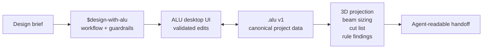
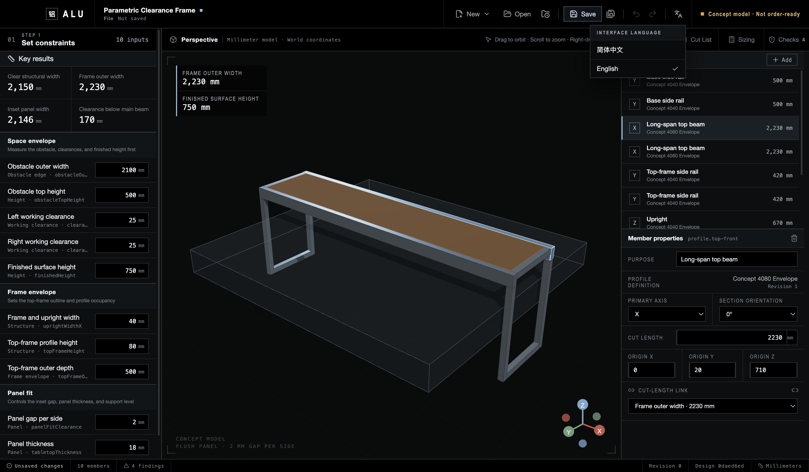
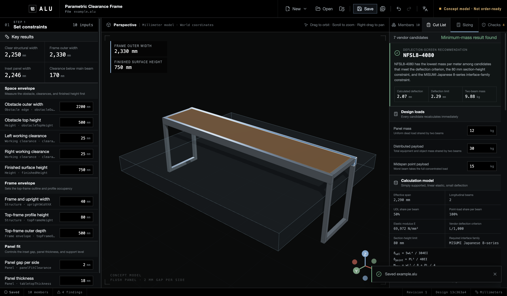

# ALU

[简体中文](README.md)

**An agent-friendly workspace for industrial aluminum-extrusion design.**

ALU turns measured constraints into an inspectable frame model, a deterministic profile cut list, and explicit engineering review items. Its strict `.alu` project format keeps stable IDs, revisions, inputs, derived dimensions, member geometry, and evidence together, so a person and an agent can reason about the same design state.


> ALU 0.2.1 alpha adds a traceable ideal-beam deflection screen. It is still not an order, fabrication drawing, complete structural analysis, rated load, or safety approval.

## Why ALU is agent-friendly

- **One inspectable project truth.** `.alu` v1 is validated JSON with explicit units, stable entity IDs, project revisions, and a deterministic design hash.
- **Inputs stay separate from results.** Measured constraints, linear derived dimensions, and member bindings remain traceable instead of collapsing into anonymous mesh geometry.
- **Outputs are reproducible.** The same project produces the same grouped profile cut list and rule findings; stale saved projections are recalculated on open.
- **Profile choice is derived, not guessed.** Structured kg load cases, effective span, exact vendor inertia, section-height and interface-family constraints, self-weight, formulas, and candidate rejection reasons stay together in the project.
- **Warnings carry context.** Findings expose a stable rule ID, rationale, evidence type, confidence, affected entities, and suggested follow-up.
- **The workflow is versioned with the product.** The bundled [`design-with-alu`](skills/design-with-alu/SKILL.md) Skill teaches an agent what to inspect, what to report, and where the alpha boundary is.
- **Humans can verify every step.** The desktop UI shows the constraints, model, members, cut list, and checks that an agent references in its handoff.



The current Skill guides desktop work; v0.2.1 does not yet provide a supported headless mutation API. Do not bypass validation by hand-editing `.alu` files.

## What ships now

- Parametric constraints for obstacle envelope, working clearance, finished height, frame occupancy, and inset-panel fit.
- A bundled clearance-frame example whose inputs update bound members in one domain command.
- Read-only 3D review in a millimeter coordinate system, with a four-sided flush inset-panel pocket.
- Add, remove, select, and numerically edit rectangular profile members.
- Deterministic profile cut-list grouping by definition revision, length, orientation, and purpose.
- Editable panel, distributed, and point loads with simply supported beam superposition, exact MISUMI candidate snapshots, height/interface filtering, and minimum-mass selection.
- Explainable design checks without presenting field-guide heuristics as structural proof.
- Strict `.alu` v1 validation, atomic save, recent projects, and BOM recalculation on reopen.
- Simplified Chinese is the first-launch default, with a complete English interface including native file dialogs.
- A constrained Electron boundary: no Node/Electron access in the renderer, narrow validated IPC, restrictive production CSP, ASAR, and fuses.

## Interface language

ALU starts in Simplified Chinese on a new local profile. If ALU has already saved a language choice, it restores that choice instead.

To switch the interface to English:

1. Click the globe icon in the top toolbar. Its tooltip reads `界面语言` in Chinese or `Interface language` in English.
2. Choose `English`.

To switch back, open the same menu and choose `简体中文`. The choice is saved locally, survives reloads and restarts, and also controls ALU's native open, save, and unsaved-changes dialogs. Project data, IDs, units, SKUs, filenames, and user-entered text are not translated.



## Install

### macOS Apple Silicon

Download `ALU-0.2.1-arm64.dmg` from the [v0.2.1 prerelease](https://github.com/OWRIG/alu/releases/tag/v0.2.1), then drag ALU into Applications.

The build is Developer ID signed but not Apple-notarized. Gatekeeper may block the first launch. Verify the release SHA-256 and source before using the documented open procedure.

### Run from source

Requires Node.js 22+ and pnpm 10.

```bash
git clone https://github.com/OWRIG/alu.git
cd alu
pnpm install
pnpm dev
```

## Five-minute design loop

The bundled example starts with a generic obstacle envelope rather than a furniture category:

1. Set `Obstacle outer width` to `2200 mm` and keep `25 mm` working clearance on each side.
2. ALU derives a `2250 mm` clear opening and a `2330 mm` outer frame.
3. With a nominal `2 mm` gap per side, the inset panel becomes `2246 × 416 × 18 mm`.
4. In Sizing, review the `12 kg` panel, `30 kg` distributed, and `15 kg` point-load assumptions. ALU compares seven exact SKUs and selects `NFSL8-4080` under the current `80 mm` height and Japanese 8-series interface constraints.
5. Review the 3D pocket, four profile cut groups, ten source members, and every unresolved check.
6. Save the `.alu` project and hand off its geometry, loads, candidate derivation, cut list, findings, and remaining real-world measurements.



See the [illustrated parametric clearance-frame example](docs/examples/parametric-clearance-frame.md).

## Use the Agent Skill

Install from the repository:

```bash
mkdir -p ~/.codex/skills
cp -R skills/design-with-alu ~/.codex/skills/
```

Then invoke it explicitly:

```text
Use $design-with-alu to inspect this .alu project and return its constraints,
derived dimensions, structural load assumptions, beam candidates, cut groups,
unresolved checks, and required field measurements.
```

The release also includes `design-with-alu-0.2.1.zip` as a standalone download.

## Boundaries that matter

- 3D 4040/4080 definitions remain simplified rectangular envelopes. The beam study snapshots exact catalog properties separately; verify the current vendor revision before procurement.
- The inset-panel dimensions are nominal. Assemble and square the frame, then measure the actual pocket before ordering a tolerance-sensitive panel.
- The v0.2.1 cut list excludes connectors, machining, fasteners, casters, panels, and accessories. It is not order-ready.
- Beam results cover ideal simply supported deflection only. Interface-family filtering does not validate exact connector SKUs; elastic stress is reported but not checked against an allowable value. Joints, sway, tipping, casters, impact, fatigue, and proof testing remain unresolved.
- Dragging, snapping, joints, complete procurement BOMs, custom catalogs, and the headless Agent interface remain later roadmap work.

## Verify and package

```bash
pnpm ready           # types, lint, format, boundaries, spec gate, tests, build
pnpm test:e2e        # real Electron locale, edit, cut-list, save, reopen flow
pnpm package:mac     # Apple Silicon DMG, ZIP, and unpacked ALU.app
pnpm package:verify  # ASAR, locale packs, executable, and size limits
pnpm test:package    # repeat the critical flow against the packaged app
```

## Documentation

- [Illustrated clearance-frame example](docs/examples/parametric-clearance-frame.md)
- [Current product behavior](docs/product-spec/specs/README.md)
- [Architecture](docs/engineering/architecture.md)
- [Domain model and `.alu` format](docs/engineering/domain-model.md)
- [Beam sizing, formulas, candidates, and evidence](docs/engineering/structural-sizing.md)
- [Testing strategy](docs/engineering/testing-strategy.md)
- [Engineering-rule catalog](docs/domain/engineering-rule-catalog.md)
- [Roadmap](docs/product-spec/roadmap.md)

The earlier overbed-table request remains available as a [domain-specific fixture walkthrough](docs/examples/mobile-overbed-table.md); it is an example, not ALU's product positioning.
