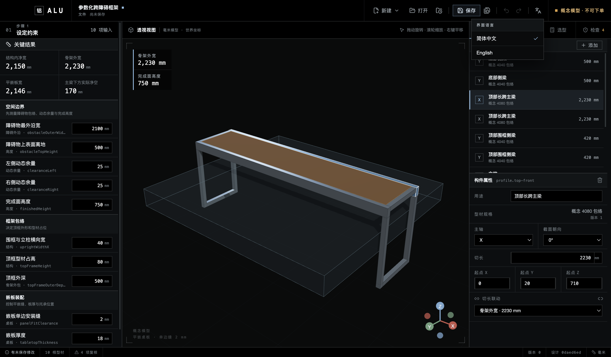

# ALU

[English](README.en.md)

**面向 Agent 的工业铝型材设计工作台。**

ALU 把实测约束转换为可检查的框架模型、确定性的型材切料清单和明确的工程复核项。严格的 `.alu` 工程格式把稳定 ID、版本、输入、派生尺寸、构件几何和证据保存在一起，让人和 Agent 基于同一份设计状态沟通。


> ALU 0.2.1 alpha 提供可追溯的理想梁挠度筛选，但仍不是订单、施工图、完整结构分析、额定载荷或安全认证。

## 为什么对 Agent 友好

- **工程真相只有一份。** `.alu` v1 是经过校验的 JSON，显式保存单位、稳定实体 ID、工程 revision 与确定性的 design hash。
- **输入与结果分开。** 实测约束、线性派生尺寸和构件绑定均可追溯，不会被压成一团匿名网格。
- **结果可以复现。** 同一工程得到相同的型材切料分组与规则结论；打开旧快照时会按当前设计重算。
- **型材选择来自推导，不靠猜。** kg 载荷、有效跨度、具体厂家惯性矩、截面高度与接口体系约束、自重、公式和候选排除原因保存在同一工程中。
- **警告带上下文。** 每条 finding 都有稳定 rule ID、原因、证据类型、置信度、关联实体与下一步。
- **工作流随产品一起版本化。** 仓库内置 [`design-with-alu`](skills/design-with-alu/SKILL.md) Skill，告诉 Agent 应该检查什么、如何交接，以及 alpha 的能力边界。
- **人可以逐项核对。** 桌面端把 Agent 交接中引用的约束、模型、构件、下料与检查同时展示出来。

当前 Skill 负责指导桌面工作流；v0.2.1 尚无受支持的 headless 写入接口。不要绕过校验手改 `.alu` 文件。

## 当前能力

- 障碍物包络、动态余量、完成高度、框架占位和平嵌板安装缝的参数化输入。
- 内置跨障碍框架示例；修改输入后，绑定构件在一次领域命令中同步更新。
- 同一毫米坐标系中的只读 3D 复核，以及四边围框形成的平嵌板卡槽。
- 矩形型材构件的新增、删除、选择与数值编辑。
- 按型材 revision、切长、朝向和用途确定性聚合的切料清单。
- 可编辑的台面、均布和集中载荷；按简支梁公式叠加，比较具体米思米候选快照、过滤高度与接口体系并选择最小质量项。
- 可解释的工程检查，不把现场经验提示写成结构证明。
- 严格 `.alu` v1 校验、原子保存、最近工程和重开时 BOM 重算。
- 首次启动默认简体中文，保留完整英文入口；renderer 与原生文件弹窗使用同一语言。
- 受限 Electron 边界：renderer 无 Node/Electron 权限，IPC 范围窄且校验输入，生产环境使用限制性 CSP、ASAR 与 fuses。

## 界面语言

新用户首次启动使用简体中文。ALU 如果已经保存过语言选择，则继续使用原来的设置。

点击顶部工具栏的地球图标，再选择 `English` 或 `简体中文`。语言选择保存在本机，重载和重启后仍然有效；打开、保存和未保存提醒等原生弹窗也会跟随切换。工程数据、稳定 ID、单位、SKU、文件名和用户输入不会被翻译。



## 安装

### macOS Apple Silicon

从 [v0.2.1 prerelease](https://github.com/OWRIG/alu/releases/tag/v0.2.1) 下载 `ALU-0.2.1-arm64.dmg`，拖入 Applications。

当前构建已做 Developer ID 签名，但尚未 Apple 公证。Gatekeeper 可能阻止首次打开；使用发布说明中的方法前，先核对 SHA-256 与源码。

### 从源码运行

需要 Node.js 22+ 与 pnpm 10。

```bash
git clone https://github.com/OWRIG/alu.git
cd alu
pnpm install
pnpm dev
```

## 五分钟闭环

内置示例从通用障碍物包络开始，不把某一种家具当成产品主语：

1. 把“障碍物最外沿宽”改为 `2200 mm`，左右动态余量各保留 `25 mm`。
2. ALU 得到 `2250 mm` 结构内净宽与 `2330 mm` 框架外宽。
3. 按每边 `2 mm` 名义安装缝，平嵌板尺寸为 `2246 × 416 × 18 mm`。
4. 在“选型”页核对 `12 kg` 台面、`30 kg` 均布与 `15 kg` 集中载荷假设；ALU 比较 7 个具体 SKU，并在当前 `80 mm` 高度与日标 8 系列接口约束下选出 `NFSL8-4080`。
5. 核对 3D 卡槽、4 个型材切料组、10 根来源构件和全部未决检查。
6. 保存 `.alu`，交接几何、载荷、候选推导、下料摘要、findings 与仍需现场测量的项目。


完整步骤见[参数化跨障碍框架图文示例](docs/examples/parametric-clearance-frame.zh-CN.md)。

## 使用 Agent Skill

从仓库安装：

```bash
mkdir -p ~/.codex/skills
cp -R skills/design-with-alu ~/.codex/skills/
```

安装后可直接说：

```text
Use $design-with-alu to inspect this .alu project and return its constraints,
derived dimensions, structural load assumptions, beam candidates, cut groups,
unresolved checks, and required field measurements.
```

Release 同时提供可独立下载的 `design-with-alu-0.2.1.zip`。

## 明确边界

- 3D 中的 4040/4080 仍是简化矩形包络；梁研究另存具体目录属性，采购前仍须核对厂家最新 revision。
- 平嵌板尺寸是名义值。先组框、校正对角线并实测卡槽，再订购误差敏感的板材。
- v0.2.1 切料清单不含连接件、加工、紧固件、脚轮、板材和附件，不能直接下单。
- 梁结果只覆盖理想简支挠度；接口体系过滤不等于具体连接件 SKU 验证，弹性应力也只报告、不按许用值判定。节点、侧摆、倾覆、脚轮、冲击、疲劳和实物验证仍未覆盖。
- 拖拽吸附、节点、完整采购 BOM、自定义目录与 headless Agent 接口仍在后续路线图中。

## 验证与打包

```bash
pnpm ready           # 类型、lint、格式、边界、规格门禁、测试与构建
pnpm test:e2e        # 真实 Electron：语言、编辑、下料、保存与重开
pnpm package:mac     # Apple Silicon DMG、ZIP 与解包后的 ALU.app
pnpm package:verify  # ASAR、语言包、可执行文件与体积上限
pnpm test:package    # 对真实安装包复跑关键闭环
```

## 文档

- [参数化跨障碍框架图文示例](docs/examples/parametric-clearance-frame.zh-CN.md)
- [当前产品行为](docs/product-spec/specs/README.md)
- [总体架构](docs/engineering/architecture.md)
- [领域模型与 `.alu` 格式](docs/engineering/domain-model.md)
- [梁选型、公式、候选与证据](docs/engineering/structural-sizing.md)
- [测试与质量门](docs/engineering/testing-strategy.md)
- [工程规则目录](docs/domain/engineering-rule-catalog.md)
- [路线图](docs/product-spec/roadmap.md)

早期跨床桌需求仍保留为[领域 fixture 说明](docs/examples/mobile-overbed-table.md)，但不再承担产品定位。
