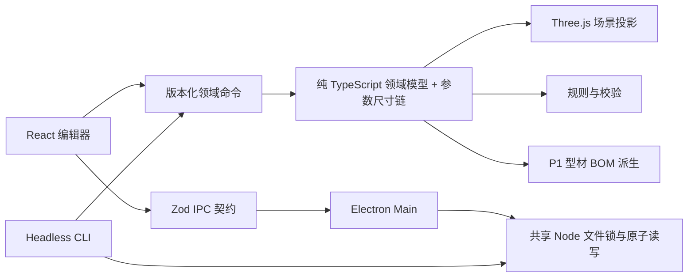

# 总体架构

## 结论

可行性高。核心难点不在 Three.js 画几根长方体，而在四件事能否长期一致：几何数据、连接与加工语义、BOM、工程文件。架构必须让它们共享一个框架无关的领域模型。

## 运行结构



### Main

Main 负责 Electron 生命周期、安全窗口、文件选择、最近工程、安装包 Headless 入口和 PDF 打印。`.alu` 文件锁、校验、报告输出与原子替换位于 Electron 无关的 `src/node/`，由 Main 与 CLI 共用；versioned report JSON 与 Markdown 位于领域层，PDF 只是一层 Electron 渲染适配。

### Preload

只暴露明确方法，例如：

```ts
window.alu.project.getLaunch();
window.alu.project.open();
window.alu.project.openRecent(id);
window.alu.project.recent();
window.alu.project.save(snapshot, expectedFileHash);
window.alu.project.saveAs(snapshot);
window.alu.settings.setLocale(locale);
```

不暴露原始 `ipcRenderer`、任意文件路径读写或 shell 执行。

### Renderer

React 负责 UI，局部普通 CSS 负责界面样式，Three.js/React Three Fiber 负责视图。Renderer 不访问 Node/Electron，也不负责解析 ZIP 或写文件。

### Domain

`src/domain/` 是产品真正的核心：按版本区分的 schema、命令、尺寸链、BOM 和规则。它只能依赖 Zod 和普通 TypeScript，已由 Vitest、Main、Renderer 与 CLI 共同复用。P1 schema 只包含 P1 已实现语义，目录合并、连接实体与迁移在对应 changeset 获批后再加入。

## 目录

```text
src/
├── domain/
│   ├── project/          # 工程 schema、规范化、语义校验与哈希
│   ├── params/           # 输入/派生参数、线性求值、绑定同步
│   ├── commands/         # 编辑器共用的版本化领域命令
│   ├── bom/              # P1 型材 BOM 纯函数派生
│   └── rules/            # 硬错误与经验警告
├── shared/
│   ├── i18n/             # Main/Renderer 共用的 locale 类型
│   └── ipc/              # Zod IPC 入参与输出契约
├── node/                  # Main/CLI 共用的文件锁、报告写入、Skill 安装与原子替换
├── cli/                   # JSON-only Headless CLI 传输层
├── main/
│   ├── core/             # 安全 BrowserWindow 与 IPC 来源校验
│   ├── i18n/             # 原生弹窗文案
│   └── features/
│       ├── project/      # 工程 IPC 与最近工程
│       └── settings/     # 受限语言同步 IPC
├── preload/
├── renderer/
│   └── src/
│       ├── components/   # 三栏 UI、3D、BOM 与规则
│       └── store/        # 工程历史、选择和文件动作
└── test-support/         # Node fixture loader，不进入 domain
```

单包足够。CLI 只是同一领域内核的构建入口；只有出现云端目录服务或第二个独立应用时，才考虑 workspace/monorepo。

## 技术选择

| 能力       | 选择                         | 约束                                                |
| ---------- | ---------------------------- | --------------------------------------------------- |
| 桌面运行时 | Electron                     | macOS/Windows 使用统一 Chromium                     |
| 构建       | electron-vite                | main/preload/renderer 一份配置                      |
| UI         | React + 普通 CSS             | 简中优先、完整英文入口；P1 不为样式引入额外构建插件 |
| 3D         | Three.js + React Three Fiber | 只消费领域投影；不持久化 Three 对象                 |
| 状态       | Zustand                      | 工程、编辑器 UI、目录分 store；不建全局万能 store   |
| 校验       | Zod                          | 工程、命令与 Main IPC 入参/输出均校验               |
| 测试       | Vitest + Playwright Electron | 纯领域测试优先，E2E 只覆盖关键闭环                  |
| 打包       | electron-builder             | macOS arm64 产物、ASAR、fuses 与内容回归            |

暂不引入 oRPC、数据库、后端、插件框架、规则 DSL。初期 IPC 少且稳定，显式 channel + Zod 更容易调试；出现重复样板的真实痛点后再评估 RPC 层。

## 编辑状态

### 工程状态

`projectStore` 持有可序列化 `ProjectDocument`。所有修改通过 `applyCommand(project, command)` 完成；`applyCommand` 是结构共享的纯函数——只重建变更路径上的对象，其余分支复用引用，禁止原地 mutation。因此 100 步撤销历史只是 100 个引用，内存开销 ≈ 累计变更量而非全量拷贝 × 100。规模实测超出预算后，再评估 Immer patch 或逆命令。

### UI 状态

相机、选中项、面板宽度、吸附开关和 hover 不进入工程文件，也不污染领域撤销。可选的 `viewState` 只在用户明确选择“保存视图”时写入工程。

### 3D 投影

Renderer 根据实体 ID 和 catalog definition 生成 Mesh。选中、拖拽和 gizmo 先产生候选命令，规则通过后才提交。BOM 绝不从 Mesh 尺寸反推。

坐标映射固定在 viewport 适配层：领域 Z 向上，three.js 默认 Y 向上，由适配层统一换算（或设置 `camera.up`）；three 坐标与对象不得写回领域状态。

## IPC 与文件安全

BrowserWindow 默认：

```ts
{
  contextIsolation: true,
  nodeIntegration: false,
  sandbox: true,
  webviewTag: false
}
```

并设置：

- `setWindowOpenHandler(() => ({ action: "deny" }))`
- 导航只允许应用自身 renderer URL
- 默认 session 拒绝所有权限检查与权限请求；当前产品不需要摄像头、麦克风、位置等能力
- preload API 白名单
- project/settings handler 精确匹配启动时计算的 renderer URL
- IPC 入参/输出双向 Zod 校验
- 文件选择由 Main 发起；Renderer 不提交任意可读路径
- `.alu` 当前是单一规范化 JSON 文档；文档 `formatVersion` 与物理容器版本独立
- 初始上限：JSON 8 MiB、实体 10,000 个、内嵌定义 2,000 个、参数 1,000 个
- ZIP 白名单与 zip-slip 防护随未来二进制容器一并启用；ZIP manifest 使用独立 `containerVersion`
- 保存使用同目录临时文件 + flush + rename；失败保留最后一次成功文件
- 生产页面只从 `alu://app` 映射的 ASAR renderer 根目录读取，不使用高权限 `file://`
- 发布包关闭 RunAsNode、NODE_OPTIONS、CLI inspect 与 file 协议额外权限，启用 ASAR 完整性和 only-load-from-ASAR

## 性能策略

- 型材几何和材质按 definition + 截面尺寸复用。
- 大量相同构件达到阈值后用 `InstancedMesh`，不在 P1 预优化。
- Zustand 订阅使用窄 selector，拖拽过程只更新候选变换，结束时提交领域命令。
- BOM 和规则结果按工程 revision 缓存；命令提交后一次重算。
- 首屏不加载供应商全目录；按系列或搜索结果加载。

## Agent Skill

当前仓库版本化 `skills/design-with-alu/`，默认编排 CLI 的 read → dry-run → apply → validate → human release → export 闭环：先收集现场约束与载荷，建立参数与构件，复核具体 SKU，再把确认结果写回模型与切料。设计阶段默认停在 `.alu` 与界面预览；`order-ready` 通过后仍须人工确认当前 revision/designHash，才从同一份 report JSON 输出正式 Markdown、JSON 或品牌 PDF。Skill 明确禁止手改 `.alu`、把评审稿冒充发布稿，或在工程修改后复用旧确认，并要求把具体连接、加工、脚轮采购、板材、整机稳定与实物验证作为未决项交接。

当前已支持 Headless CLI 和桌面保存时的外部修改冲突保护；不提供 MCP server、运行中主动重载提示或 live attach。CLI 与 UI 共享领域内核，不是第二套业务入口。

## 从 Keel 借与不借

借：三进程硬边界、renderer 禁 Node、Zod 契约、领域 feature 分目录、产品行为账本、边界门禁、隔离 E2E profile、打包内容回归。

不借：monorepo、后端、插件系统、oRPC MessagePort、复杂 runtime port、Sentry/升级/多构建 profile。它们解决的是 Keel 已经发生的问题，不是 ALU P0 的问题。
