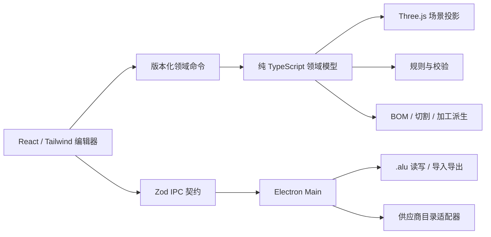

# 总体架构

## 结论

可行性高。核心难点不在 Three.js 画几根长方体，而在四件事能否长期一致：几何数据、连接与加工语义、BOM、工程文件。架构必须让它们共享一个框架无关的领域模型。

## 运行结构



### Main

负责 Electron 生命周期、窗口、文件选择、工程包、目录持久化、CSV/JSON 导出和厂商数据导入。任何 Node 文件系统能力都留在这里。

### Preload

只暴露明确方法，例如：

```ts
window.alu.project.open()
window.alu.project.save(snapshot)
window.alu.project.saveAs(snapshot)
window.alu.bom.exportCsv(snapshot)
window.alu.catalog.importFile()
```

不暴露原始 `ipcRenderer`、任意文件路径读写或 shell 执行。

### Renderer

React 负责 UI，Tailwind CSS 4 负责界面样式，Three.js/React Three Fiber 负责视图。Renderer 不访问 Node/Electron，也不负责解析 ZIP 或写文件。

### Domain

`src/domain/` 是产品真正的核心：schema、命令、尺寸链、BOM、目录合并、规则和迁移。它只能依赖 Zod 和普通 TypeScript，可在 Vitest、Main、Renderer 或未来 CLI 中复用。

## 目录

```text
src/
├── domain/
│   ├── project/          # 工程 schema、迁移、规范化与哈希
│   ├── catalog/          # 中性零件目录与引用解析
│   ├── model/            # 型材、节点、板材、脚轮等实体
│   ├── commands/         # 人工、模板和 AI 共用命令
│   ├── bom/              # 派生、调整、导出投影
│   └── rules/            # 硬错误与经验警告
├── shared/
│   └── ipc/              # Zod IPC 入参与输出契约
├── main/
│   ├── core/             # app、window、日志、路径
│   └── features/
│       ├── project/      # .alu 原子读写
│       ├── catalog/      # 本地目录与 vendor adapters
│       └── export/       # BOM、切割表、加工表
├── preload/
└── renderer/
    └── src/
        ├── features/editor/
        ├── features/catalog/
        ├── features/bom/
        ├── stores/
        └── viewport/
```

单包足够。只有出现真正独立的 CLI、云端目录服务或第二个应用时，才考虑 workspace/monorepo。

## 技术选择

| 能力 | 选择 | 约束 |
| --- | --- | --- |
| 桌面运行时 | Electron | macOS/Windows 使用统一 Chromium |
| 构建 | electron-vite | main/preload/renderer 一份配置；Tailwind 只挂 renderer |
| UI | React + Tailwind 4 | 中文优先；不把动态 Three 材质拼成 Tailwind class |
| 3D | Three.js + React Three Fiber | 只消费领域投影；不持久化 Three 对象 |
| 状态 | Zustand | 工程、编辑器 UI、目录分 store；不建全局万能 store |
| 校验 | Zod | 工程、目录、命令、IPC 四个边界均校验 |
| 测试 | Vitest + Playwright Electron | 纯领域测试优先，E2E 只覆盖关键闭环 |
| 打包 | electron-builder | P5 再接签名、升级与发布回归 |

暂不引入 oRPC、数据库、后端、插件框架、规则 DSL。初期 IPC 少且稳定，显式 channel + Zod 更容易调试；出现重复样板的真实痛点后再评估 RPC 层。

## 编辑状态

### 工程状态

`projectStore` 持有可序列化 `ProjectDocument`。所有修改通过 `applyCommand(project, command)` 完成。MVP 撤销历史保存最近 100 个工程快照；模型规模证明快照成本过高后，再切 Immer patch 或逆命令。

### UI 状态

相机、选中项、面板宽度、吸附开关和 hover 不进入工程文件，也不污染领域撤销。可选的 `viewState` 只在用户明确选择“保存视图”时写入工程。

### 3D 投影

Renderer 根据实体 ID 和 catalog definition 生成 Mesh。选中、拖拽和 gizmo 先产生候选命令，规则通过后才提交。BOM 绝不从 Mesh 尺寸反推。

## IPC 与文件安全

BrowserWindow 默认：

```ts
{
  contextIsolation: true,
  nodeIntegration: false,
  sandbox: true,
  webviewTag: false
}
```

并设置：

- `setWindowOpenHandler(() => ({ action: "deny" }))`
- 导航只允许应用自身 renderer URL
- preload API 白名单
- IPC 入参/输出双向 Zod 校验
- 文件选择由 Main 发起；Renderer 不提交任意可读路径
- ZIP 拒绝绝对路径、`..`、符号链接、重复条目和超限解压
- `.alu` 初始上限：压缩包 32 MiB、manifest 64 KiB、工程 JSON 8 MiB、单预览图 4 MiB、实体 10,000 个、内嵌定义 2,000 个
- 保存使用同目录临时文件 + flush + rename；失败保留最后一次成功文件

## 性能策略

- 型材几何和材质按 definition + 截面尺寸复用。
- 大量相同构件达到阈值后用 `InstancedMesh`，不在 P1 预优化。
- Zustand 订阅使用窄 selector，拖拽过程只更新候选变换，结束时提交领域命令。
- BOM 和规则结果按工程 revision 缓存；命令提交后一次重算。
- 首屏不加载供应商全目录；按系列或搜索结果加载。

## 从 Keel 借与不借

借：三进程硬边界、renderer 禁 Node、Zod 契约、领域 feature 分目录、产品行为账本、边界门禁、隔离 E2E profile、打包内容回归。

不借：monorepo、后端、插件系统、oRPC MessagePort、复杂 runtime port、Sentry/升级/多构建 profile。它们解决的是 Keel 已经发生的问题，不是 ALU P0 的问题。
