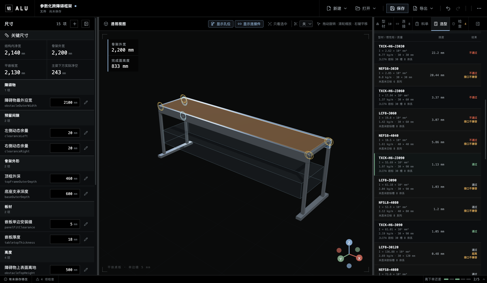

# 梁选型与挠度筛选

ALU 的梁选型回答一个受限但可复算的问题：在给定载荷、有效跨度、截面高度上限、可选接口体系和候选 SKU 集合中，哪一个满足全部明确约束且单位质量最小。

它不是整机承载认证。接口体系过滤也不等于具体连接件验证；连接刚度、局部失效、台面组合效应、侧摆、倾覆、脚轮、冲击、疲劳和材料许用应力仍需另行验证。

## 默认研究输入

默认跨障碍框架把两根纵向顶梁分别视为两端简支梁。跨度取左右立柱中心线之间的 `2190 mm`，不是 `2230 mm` 切长。

| 输入         | 数值               | 分配到最不利单梁                        |
| ------------ | ------------------ | --------------------------------------- |
| 台面质量     | 12 kg              | 按均布恒载，单梁承担 50%                |
| 均布使用载荷 | 30 kg              | 单梁承担 50%                            |
| 跨中集中载荷 | 15 kg              | 保守地令一根梁承担 100%                 |
| 型材自重     | 随候选 SKU 变化    | 每根梁承担自身重量                      |
| 弹性模量     | 69,972 N/mm²       | 米思米公开计算示例采用值                |
| 挠度准则     | `L/1000 = 2.19 mm` | 米思米公开的实际使用最大挠度选型准则    |
| 截面高度上限 | 80 mm              | 独立空间约束 `topBeamMaximumHeight`     |
| 所需接口体系 | 米思米日标 8 系列  | 与当前 4040 端框的槽口/配件体系保持一致 |

这组 kg 数值是可编辑的示例目标，不是标准规定。实际工程应录入真实板重、设备质量和需要覆盖的集中载荷；有人倚靠、儿童攀爬或其他人身风险时，不应继续把本筛选当作安全结论。

## 公式与单位

ALU 使用米思米公开的两端简支梁公式，并在小变形线弹性范围内叠加各分项：

```text
均布载荷最大挠度     δudl   = 5wL⁴ / (384EI)
跨中集中载荷最大挠度 δpoint = PL³ / (48EI)
最大弯矩             Mmax   = wL² / 8 + PL / 4
弹性弯曲应力         σ      = Mmax / Z
对称截面弹性模量     Z      = I / (h/2)
```

- `w`：单梁均布线载荷，N/mm；包括半数台面质量、半数均布使用载荷与该候选的自重。
- `P`：最不利单梁的跨中集中力，N。
- `L`：有效支承跨度，mm。
- `E`：弹性模量，N/mm²。
- `I`：按实际竖向强轴方向使用的截面惯性矩，mm⁴。

数值依据来自米思米的[容许负载流程与 L/1000 准则](https://cn.c.misumi.com.cn/book/sh2_2018_msm_fa_01/pdf/2146.pdf)以及[简支梁公式和弹性模量示例](https://cn.c.misumi.com.cn/book/sh2_2018_msm_fa_01/pdf/2147.pdf)。

## 候选比较

候选数据全部保存进 `.alu`，不在运行时按“3030/4040/4080”名称猜测。默认研究使用米思米具体 SKU，并把矩形截面的较高边沿 Z 方向放置。欧标 LCF 系列被保留在比较表中，但米思米目录明确说明其专用配件与现有日标体系不兼容：

| 候选       | 截面     | 质量 kg/m | 强轴 `I` mm⁴ | 两根切料质量 |   总挠度 | 高度 | 接口体系 | 结果                   |
| ---------- | -------- | --------: | -----------: | -----------: | -------: | ---- | -------- | ---------------------- |
| NEFS6-3030 | 30 × 30  |      0.80 |     2.85×10⁴ |      3.57 kg | 31.44 mm | 通过 | 日标 6   | 挠度不通过、接口不兼容 |
| LCF8-3060  | 30 × 60  |      1.42 |     19.8×10⁴ |      6.33 kg |  4.66 mm | 通过 | 欧标槽 8 | 挠度不通过、接口不兼容 |
| NEFS8-4040 | 40 × 40  |      1.61 |     10.5×10⁴ |      7.18 kg |  8.86 mm | 通过 | 日标 8   | 挠度不通过             |
| LCF8-3090  | 30 × 90  |      2.04 |    61.18×10⁴ |      9.10 kg |  1.55 mm | 超高 | 欧标槽 8 | 高度、接口均排除       |
| NFSL8-4080 | 40 × 80  |      2.12 |     52.9×10⁴ |      9.46 kg |  1.80 mm | 通过 | 日标 8   | **入选**               |
| LCF8-30120 | 30 × 120 |      2.69 |   136.88×10⁴ |     12.00 kg |  0.71 mm | 超高 | 欧标槽 8 | 高度、接口均排除       |
| NEFS8-4080 | 40 × 80  |      2.79 |     72.6×10⁴ |     12.44 kg |  1.35 mm | 通过 | 日标 8   | 通过但更重             |

来源：[30 mm 方形目录](https://www.misumi.com.cn/pdf/fa/2018/p2127.pdf)、[40 mm 方形目录](https://www.misumi.com.cn/pdf/fa/2018/p2137.pdf)、[欧标 30 系矩形目录](https://www.misumi.com.cn/pdf/vona/P3_202005_04.pdf)、[40 × 80 mm 目录](https://www.misumi.com.cn/pdf/fa/2018/p2139.pdf)。



这个结果比“长跨就用 4080”更精确：`LCF8-3090` 的重量其实更低、挠度也通过，但它超过当前 80 mm 高度包络，并且属于不兼容的欧标配件体系；`NFSL8-4080` 才是当前挠度、几何和接口约束内的最小质量项。若允许 90 mm 截面、主动切换配件体系并重做净空与节点设计，应建立新的研究，结论可能改变。

默认入选项的分项挠度为：

```text
台面恒载          0.217 mm
均布使用载荷      0.544 mm
型材自重          0.168 mm
跨中集中载荷      0.870 mm
合计              1.799 mm <= 2.190 mm
```

计算同时报告约 `11.3 N/mm²` 的弹性弯曲应力，但不会把它判为“通过”，因为当前候选快照没有材料许用应力与适用安全系数。给定基础均布载荷下反算出的跨中质量上限约为 `21.7 kg`，它也只是 `L/1000` 挠度上限，不是额定承载。

## 可选构造资料如何进入设计

`constructionEvidence` 是可选、平台中立的构造资料层，不是梁计算的 schema 门槛。它可以记录现场实测、装配试验或公开技术资料，但只用于说明构造与装配，不进入数值承载计算。

每条记录都应写明来源、适用范围、已确认事实和未决项。缺少具体 SKU、加载方向或测试条件时，不得把定性描述写入计算输入。

计算得到的 `selected` 只是建议。用户点击“应用到模型与下料”后，ALU 才为关联梁写入具体厂家 SKU、截面包络与来源 snapshot，并同步实际截面参数；之后 3D 与 BOM 消费同一份 definition。载荷变化只更新建议，不静默替换已经应用的型材。

## 结果失效条件

以下任一变化都必须重算或进入更高一级验证：

1. 改变有效跨度、梁数、载荷分配、截面方向或具体 SKU；
2. 把点载荷放到跨中以外、把台面视为组合梁，或采用非简支连接模型；
3. 需要校核材料强度、连接件、槽口局部承压、整体侧摆或倾覆；
4. 涉及人身承载、攀爬、冲击、反复移动或疲劳；
5. 厂家目录修订、实际来料与快照不一致，或长料运输/加工约束改变。
