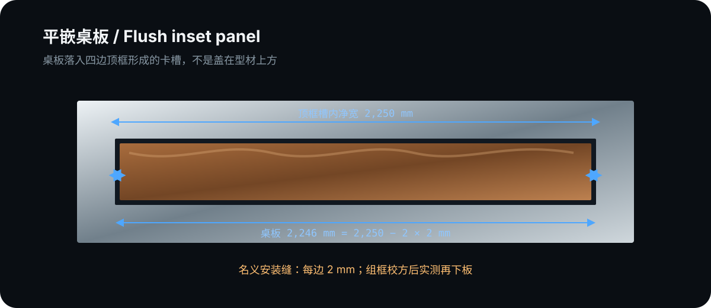
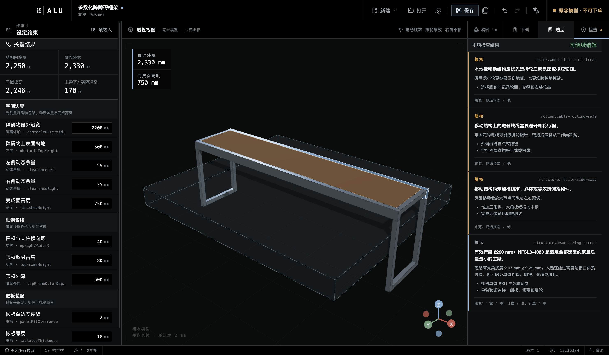

# 领域示例：跨床移动桌

> 这是用于验证 ALU 结构化推导能力的领域样例，不是产品定位，也不是可直接施工或承载认证的成品方案。

这个版本把三件事分开处理：现场尺寸决定几何，小红书视频沉淀决定构造方向，厂家截面数据与梁公式决定长梁候选。任何一层都不替代另外两层。


## 1. 先定义现场边界

| 输入           |    数值 | 设计含义                             |
| -------------- | ------: | ------------------------------------ |
| 床架最外沿宽   | 2200 mm | 测最宽的真实障碍，不使用床垫标称宽   |
| 左侧动态余量   |   25 mm | 移动偏斜、床品鼓包和测量误差         |
| 右侧动态余量   |   25 mm | 与左侧独立，不假设现场完全对称       |
| 床垫上表面离地 |  500 mm | 检查主梁下净空                       |
| 桌面完成高度   |  750 mm | 平嵌板上表面的目标高度               |
| 端框型材宽度   |   40 mm | 立柱、围框侧梁与底梁的概念 4040 包络 |
| 长梁高度上限   |   80 mm | 当前净空允许的纵向主梁截面高度上限   |
| 顶框外深       |  500 mm | 工作面前后外包尺寸                   |
| 桌板单边安装缝 |    2 mm | 名义值；组框校方后以实测最小槽宽为准 |
| 桌板厚度       |   18 mm | 影响托承高度、板重和完成面           |

横向尺寸链为：

```text
床架外宽 2200
+ 左余量 25 + 右余量 25
= 结构内净宽 2250
+ 两侧端框占位 2 × 40
= 框架外宽 2330 mm
```

两根长梁的切长是 `2330 mm`，但梁计算使用左右立柱中心线之间的 `2290 mm` 有效跨度。把切长当跨度会把支承位置弄错。

## 2. 木板是落入卡槽，不是盖在框上

四边围框形成 `2250 × 420 mm` 槽内净空。每边扣除 2 mm 名义安装缝后：

```text
桌板 = 2246 × 416 × 18 mm
```



桌板由四边连续内托条或已验证层板托承托，板面与围框上沿齐平。正确装配顺序是：

1. 先完成顶框与端框，测两条对角线并校方；
2. 测卡槽多个位置的最小净宽、最小净深；
3. 再按实际材料膨胀、封边和拆装需求确认最终缝隙；
4. 最后下单板材，不按 CAD 名义尺寸盲切。

这项构造来自小红书笔记[《盘一盘铝型材桌面的 6 种常用方法！》](https://www.xiaohongshu.com/explore/6879d1ea0000000011001330)。笔记只支持“内托平嵌 + 留装配缝”的做法，不提供层板托额定值。

## 3. 把视频沉淀落实到载荷路径

ALU 把既有视频提取写进 `extensions.structuralSizing.constructionEvidence`，并将其用于下面的构造决策：

- [多功能床笔记](https://www.xiaohongshu.com/explore/69f2ab49000000001e00e55b)中的“主型材连续不断点”用于两根纵向长梁；不照搬十根床腿或人身承载结论。
- [1.6 m 电脑桌笔记](https://www.xiaohongshu.com/explore/6a0eefda000000000802760c)中的“可见面内置连接 + 受力面外角码”用于四个长梁—端框主节点；视频中的“很稳”不进入载荷数值。
- [多功能工作桌笔记](https://www.xiaohongshu.com/explore/6a2150160000000006032e93)中的预埋组合连接件、侧横杆和层板托用于装配顺序与端框闭合。

默认概念模型因此不再把 4080 铺满全框：两根长梁保留 4080 高包络，端框侧梁、四根立柱和两根底梁改为 4040 概念包络。具体接头、角码、孔位和紧固件仍未进入 BOM，不能从这一步直接下单。

## 4. 用明确工况选择长梁

示例载荷可在“选型”页直接修改：

| 工况         |   输入 | 单梁模型                  |
| ------------ | -----: | ------------------------- |
| 桌板质量     |  12 kg | 均布恒载，两根梁各 50%    |
| 均布使用载荷 |  30 kg | 两根梁各 50%              |
| 跨中集中载荷 |  15 kg | 最不利地由一根梁承担 100% |
| 型材自重     | 随 SKU | 每个候选自动计入          |

计算采用两端简支、`E = 69,972 N/mm²`、小变形线弹性叠加，并按米思米公开的 `L/1000` 准则取挠度上限 `2.29 mm`：

```text
δudl   = 5wL⁴ / (384EI)
δpoint = PL³ / (48EI)
```


在 `2290 mm` 有效跨度、`80 mm` 截面高度上限和米思米日标 8 系列接口约束下，结果为：

| 候选       | 两根梁质量 |   总挠度 | 高度约束   | 接口体系 | 判定               |
| ---------- | ---------: | -------: | ---------- | -------- | ------------------ |
| NEFS6-3030 |    3.73 kg | 36.01 mm | 通过       | 不兼容   | 挠度、接口均不通过 |
| LCF8-3060  |    6.62 kg |  5.34 mm | 通过       | 不兼容   | 挠度、接口均不通过 |
| NEFS8-4040 |    7.50 kg | 10.16 mm | 通过       | 兼容     | 挠度不通过         |
| LCF8-3090  |    9.51 kg |  1.78 mm | 超过 80 mm | 不兼容   | 高度、接口均排除   |
| NFSL8-4080 |    9.88 kg |  2.07 mm | 通过       | 兼容     | **入选**           |
| LCF8-30120 |   12.54 kg |  0.82 mm | 超过 80 mm | 不兼容   | 高度、接口均排除   |
| NEFS8-4080 |   13.00 kg |  1.55 mm | 通过       | 兼容     | 通过但更重         |

所以结论不是“长跨经验上用 4080”，而是：在当前载荷、2290 mm 跨度、80 mm 高度上限、日标 8 系列接口约束和这组厂家候选中，轻型 `NFSL8-4080` 是满足全部筛选约束的最小质量项。

`LCF8-3090` 提醒了为什么必须同时带几何和接口约束：它比轻型 4080 更轻且挠度更小，但高 90 mm，会额外侵占床上净空；米思米也明确说明该欧标系列的专用配件与现有日标体系不兼容。若用户允许 90 mm、主动切换配件体系并重新设计节点和净空，应另建研究，最优项可能改变。


完整公式、默认 2190 mm 工况与厂家数据链接见[梁选型与挠度筛选](../engineering/structural-sizing.md)。

## 5. 读切料清单，但不要把它当订单

几何输入完成后，型材切料分为四组：

| 用途         | 概念包络 |    切长 | 数量 |
| ------------ | -------- | ------: | ---: |
| 纵向长跨主梁 | 4080     | 2330 mm |    2 |
| 顶框端部侧梁 | 4040     |  420 mm |    2 |
| 立柱         | 4040     |  670 mm |    4 |
| 底部端框侧梁 | 4040     |  500 mm |    2 |

“选型”页的 `NFSL8-4080` 是主梁筛选结果；3D 与切料页仍显示简化矩形包络。端框 4040、连接件、加工、脚轮和托条尚未完成数值选型。

## 6. 尚未证明的部分



- 四个主节点的连接刚度、角码数量、螺栓预紧与槽口局部承压；
- 端框矩形在推行、急停与锁轮侧推下的侧摆；
- 整机重心、侧向推力和床沿碰撞下的倾覆；
- 四只脚轮的单轮载荷、制动、轮径、轮面和安装总高；
- 内托条或层板托的连续性、紧固与板边局部承压；
- 材料许用应力、安全系数、冲击、疲劳与实物验证。

如果存在坐人、倚靠、攀爬或儿童接触，必须停止使用本示例作为安全依据，转入专业结构复核。

## 7. Agent 交接格式

Agent 不应只回复“建议 4080”，至少要交接：

1. 实测障碍包络、动态余量、完成高度和截面高度上限；
2. 切长与有效跨度的区别；
3. 桌板名义尺寸、安装缝和“组框后实测”要求；
4. 三项 kg 载荷、两种分配系数、梁模型与挠度准则；
5. 所有候选的 SKU、质量、惯性矩、接口体系、挠度、约束排除原因与厂家来源；
6. 入选项及“仅在当前候选和约束内最小质量”的限定；
7. 小红书构造证据与数值证据的分层；
8. 节点、侧摆、倾覆、脚轮、托承和实物测试等未决项；
9. 保存后的 `.alu` 文件路径。
