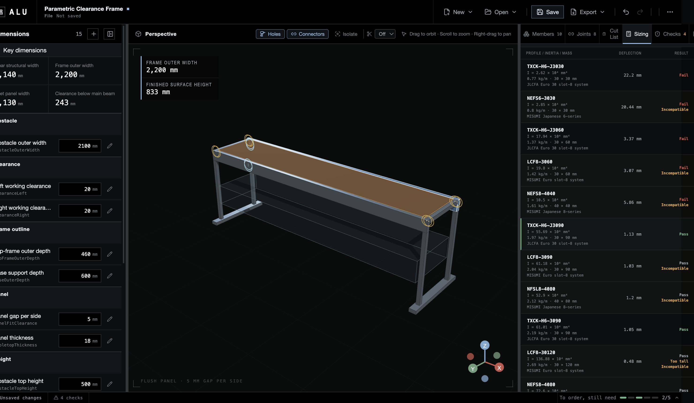
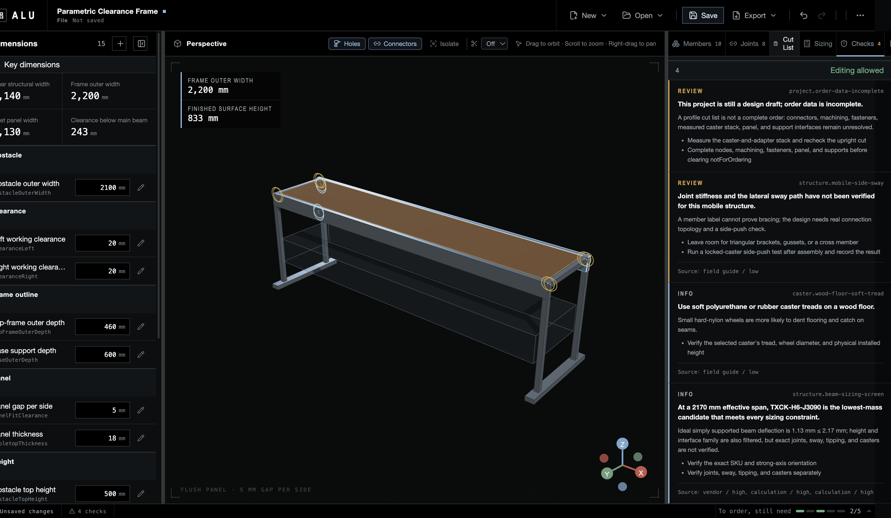

# Example: an agent-readable parametric clearance frame

[简体中文](parametric-clearance-frame.zh-CN.md)

> ALU starts in Simplified Chinese on a new local profile. Use the globe menu to switch to `English` and back to `简体中文`.

This example shows ALU's core loop: capture measured constraints, adapt production cuts to convenient dimensions, recalculate the long beam, and keep unresolved work explicit. It remains a review model, not an order file.


## 1. Enter measured constraints

| Input                               |      Value | Meaning                                                      |
| ----------------------------------- | ---------: | ------------------------------------------------------------ |
| Obstacle outer width                |   2,100 mm | Widest measured keep-out envelope                            |
| Left / right working clearance      | 20 / 20 mm | Motion, bedding, and measurement allowance                   |
| Obstacle top height                 |     500 mm | Reference for vertical clearance                             |
| Nominal finished surface height     |     833 mm | 17 mm below the 850 mm target, inside the ±30 mm tolerance   |
| Frame and upright width             |      30 mm | JLCFA Euro 30 slot-8 interface                               |
| Top-beam height                     |      90 mm | J3090 with its strong axis vertical                          |
| Top-frame outer depth               |     460 mm | Produces a 400 mm clear pocket depth                         |
| Base support depth                  |     600 mm | Flat 3060 members retain the anti-tip baseline               |
| Caster and adapter installed height |     113 mm | 103 mm caster plus provisional 10 mm adapter; measure it     |
| Nominal panel gap per side          |       5 mm | Quotation placeholder; measure the squared pocket before cut |
| Panel thickness                     |      18 mm | Sets the support level and top-face relationship             |

## 2. Follow the dimension chain

```text
obstacle outer width 2100
+ left clearance 20 + right clearance 20
= clear structural width 2140
+ two profile widths 2 × 30
= top-frame outer width 2200 mm
```

The front and rear beams leave `460 − 2 × 30 = 400 mm` inside. With a nominal 5 mm gap on each edge, the quotation placeholder is:

```text
panel = 2130 × 390 × 18 mm
```


Continuous ledges or verified shelf supports must carry the panel. Assemble, square, and measure the frame at multiple locations before the final panel order. The 5 mm gap is a manufacturing-friendly starting allowance, not proof of the final cut.

The vertical chain keeps extrusion cuts on simple dimensions:

```text
caster and adapter installed height 113 (measure before cutting)
+ flat 3060 base height 30
+ 3030 upright cut 600
+ J3090 beam height 90
= nominal finished surface height 833 mm
```

## 3. Size the long beam from an explicit load case

- `12 kg` panel mass and `15 kg` distributed payload, each shared 50/50 by two beams;
- `10 kg` midspan point payload assigned 100% to the worst beam;
- candidate self-weight;
- `2,170 mm` effective support span rather than the `2,200 mm` cut length;
- `L/1000 = 2.17 mm`, a 90 mm height limit, and the JLCFA Euro 30 slot-8 interface.


JLCFA `TXCK-H6-J3030` and `TXCK-H6-J3060` fail the deflection screen. Lightweight `TXCK-H6-J3090` calculates to about `1.131 mm` against a `2.17 mm` limit and is the lowest-mass eligible compatible candidate. Standard `TXCK-H6-3090` also passes but is heavier.



This is an ideal simply supported beam screen, not a frame load rating. See the [calculation model, complete candidate table, and source links](../engineering/structural-sizing.md).

## 4. Verify reproducible outputs

| Purpose             | Exact SKU     | Cut length | Quantity |
| ------------------- | ------------- | ---------: | -------: |
| Long-span top beam  | TXCK-H6-J3090 |   2,200 mm |        2 |
| Top-frame side rail | TXCK-H6-J3030 |     400 mm |        2 |
| Upright             | TXCK-H6-J3030 |     600 mm |        4 |
| Flat base rail      | TXCK-H6-J3060 |     600 mm |        2 |


This list excludes connectors, machining, fasteners, casters, the panel, and accessories. It cannot be used as a purchase order.

## 5. Keep uncertainty explicit



- Verify the 20 mm per-side clearance with the bedding at its widest.
- The 113 mm caster-and-adapter height still includes a provisional value.
- Joints, sway, tipping, supports, brakes, and physical proof testing remain unresolved.
- During review, keep the `.alu`, in-app preview, and summary only. Formal renders or engineering handoffs require passing `order-ready` and explicit human confirmation of the current revision/designHash.

Inspect `.alu` files, but do not edit their JSON directly. Use the desktop app or Headless CLI so schema validation, revision/designHash checks, bindings, and derived results remain consistent.
