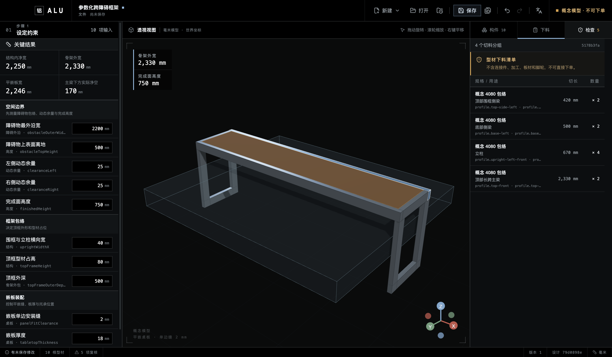

# 示例：Agent 可读的参数化跨障碍框架

[English](parametric-clearance-frame.md)

这个示例只演示 ALU 的核心闭环：记录实测约束、派生框架、检查确定性结果，并把未决项交接清楚。障碍物可以是设备、家具、储物区或其他需要避让的包络。


## 1. 输入实测约束

| 输入             |     数值 | 含义                               |
| ---------------- | -------: | ---------------------------------- |
| 障碍物最外沿宽   | 2,200 mm | 实测最宽的禁入包络                 |
| 左侧动态余量     |    25 mm | 移动、偏斜与测量误差余量           |
| 右侧动态余量     |    25 mm | 与左侧独立输入，不默认现场对称     |
| 障碍物上表面离地 |   500 mm | 用于检查竖向净空                   |
| 完成面高度       |   750 mm | 目标上表面高度                     |
| 围框与立柱横向宽 |    40 mm | 概念包络，不代表具体厂家截面       |
| 顶框型材占高     |    80 mm | 影响立柱长度与主梁下净空           |
| 顶框外深         |   500 mm | 前后方向整体包络                   |
| 嵌板单边安装缝   |     2 mm | 名义值；切板前必须实测组装后的卡槽 |
| 嵌板厚度         |    18 mm | 决定托承位置与完成面关系           |

## 2. 读懂尺寸链

ALU 保留输入与公式，不把关系烘焙进几何：

```text
障碍物外宽 2200
+ 左余量 25 + 右余量 25
= 结构内净宽 2250
+ 两侧型材占位 2 × 40
= 框架外宽 2330 mm
```

平嵌板从卡槽内净空计算，不从框架外轮廓计算：

```text
2250 − 2 × 2 = 2246 mm
```

名义板材尺寸为 `2246 × 416 × 18 mm`。板面与四边围框上沿齐平；实际托承硬件尚未选型，3D 中只显示概念位置。


## 3. 核对可复现结果

修改宽度后，模型、绑定构件与切料清单一起更新。型材切料清单包含 4 个分组、10 根来源构件：

| 用途         |     切长 | 数量 |
| ------------ | -------: | ---: |
| 顶部长跨主梁 | 2,330 mm |    2 |
| 顶部围框侧梁 |   420 mm |    2 |
| 立柱         |   670 mm |    4 |
| 底部侧梁     |   500 mm |    2 |



这份清单不含连接件、加工、紧固件、脚轮、板材和附件，不能作为采购订单。

## 4. 明确保留不确定性

“检查”页记录当前模型没有证明的事项。本例的长跨梁需要厂家数据与挠度复核；若结构需要移动，还要补充抗侧摆方案、核对脚轮并处理线缆路径。


Agent 交接至少应包含：

1. 障碍物实测包络与选定余量；
2. 派生的框架与平嵌板尺寸；
3. 名义安装缝和“组装后实测”的要求；
4. 型材切料分组与来源构件数量；
5. 全部未决 finding 与缺少的证据；
6. 保存后的 `.alu` 路径。

`.alu` 是可检查的 JSON，但 v0.1.1 尚无受支持的 headless 写入 API。通过 ALU 修改，才能保留 schema 校验、revision 检查、字段绑定与派生结果的一致性。
